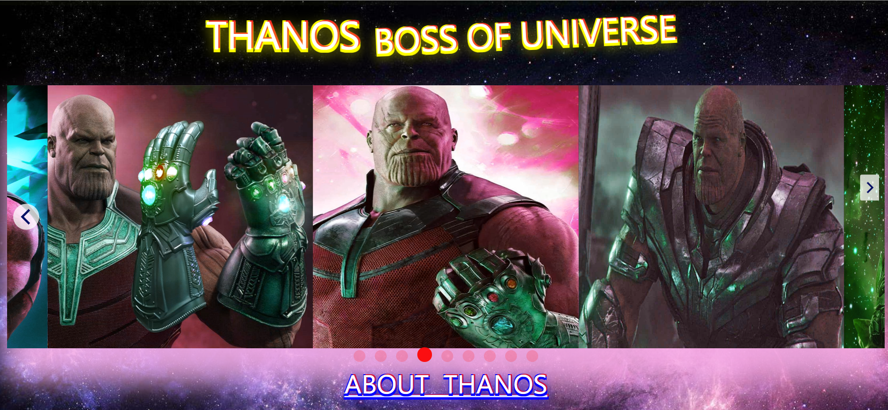

# THANOS:star_struck:

[](https://shields.io/) [](https://shields.io/) [](https://shields.io/)

***This new Web application is created by Biswarup Bhattacharjee, student of BTECH, in University of Engineering and Management, Kolkata.***

*Email Id: bbiswa471@gmail.com.*

*Contact No: 916290272740.*

[](https://www.facebook.com/biswarup.bhattacharjee.5811) [](https://github.com/biswa2210)

## About :point_down:
**:heart_eyes:Thanos' fans will love this!!!:heart_eyes:** Thanos is a fictional supervillain appearing in American comic books published by Marvel Comics. He was created by writer-artist Jim Starlin. Thanos was a genocidal warlord from Titan, whose own main objective was to bring stability to the universe, as he believed its massive population would inevitably use up the universe's entire supply of resources and condemn this. To complete this goal, Thanos set about hunting down all the Infinity Stones, as the combined efforts might wipe out half the universe. Thanos soon found himself challenged by the alliances of the entire universe's greatest heroes, which included the Avengers and Guardians of the Galaxy. The story of avengers evolves around him. Thanos is regarded as one of the most powerful beings in the Marvel Universe. This web page contains his details and his rare images with graceful designs. *It is fully responsive.*

***LINK : :point_right:https://biswa2210.github.io/THANOS/***

## Purpose :point_down:
Thanos was a genocidal warlord from Titan, whose own main objective was to bring stability to the universe, as he believed its massive population would inevitably use up the universe's entire supply of resources and condemn this. To complete this goal, Thanos set about hunting down all the Infinity Stones, as the combined efforts might wipe out half the universe. I have made this page for those people who want to really know about this supervillain. Here I have collected details about Thanos and designed this page with some different look of him.
## Use :point_down:
It is really easy to use this page. To see images in sliders user has to click on the arrow. to read about Thanos, Infinity Gaunlett, Infinity stones user just has to click on the images. 
## Importance :point_down:
Thanos engaged in a ferocious crusade, in order to obtain the Infinity Stones. During his mission, both Thanos and his Black Order invaded multiple planets and slaughtered thousands to gain the stones, including Loki and the Asgardians. This quest even forced Thanos to sacrifice his beloved Gamora, in order to take the Soul Stone. Thanos soon found himself challenged by the alliances of the entire universe's greatest heroes, which included the Avengers and Guardians of the Galaxy. Those who want to explore various diffrent interesting facts about Thanos it's nice option for them without searching. For fans as well as new comers of avengers' world can use this page very easily. :supervillain:
## Folder Structure :point_down:
```bash
Thanos
   ├── index.html
   ├── thanos.css
   └── thanos.js
 ```
## Making :point_down:
I have made this using advance level HTML5, CSS3 and Javascript. I have used sliders, row column concepts for designing. I have used filter property in css in img tag and I have used hue rotation property in figure to make these extraordinary images. I have used animations for slideshow designing.

*I have used _[marvel fandom wiki]_ (https://marvelcinematicuniverse.fandom.com/wiki/Marvel_Cinematic_Universe) for references of every Thanos' character.*

## Screenshots :point_down: 
<div align="center">
<a href="s1.PNG"></a> <a href="s2.PNG"></a>
   
<a href="s3.PNG"></a> <a href="s4.PNG"></a>

<a href="s5.PNG"></a> <a href="s6.PNG"></a>
</div>
